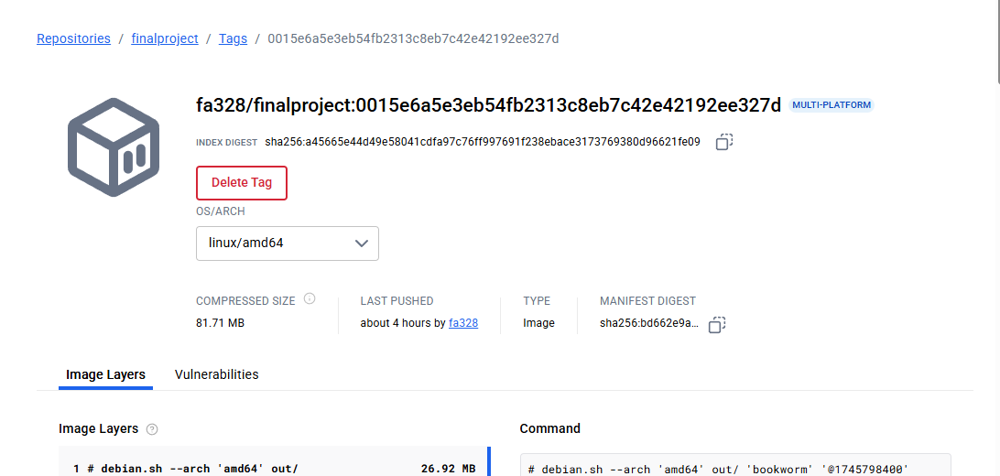
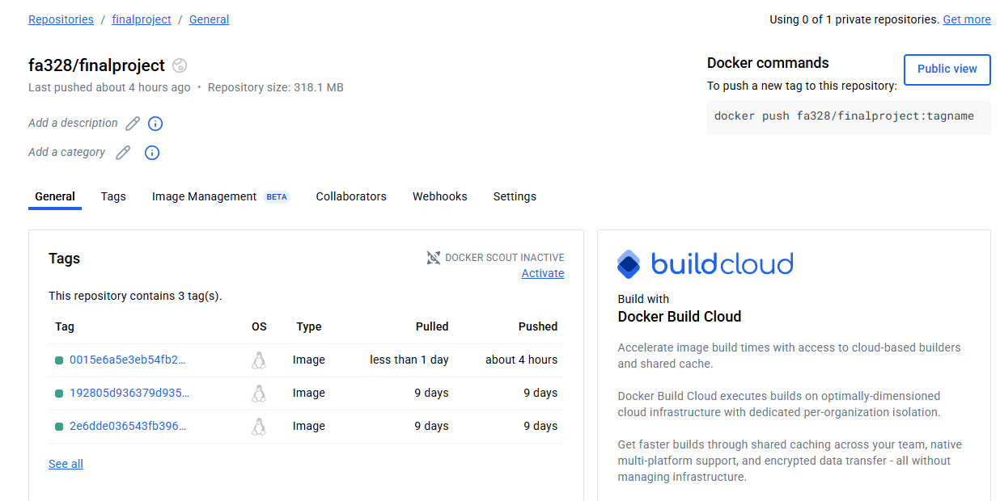

# User Management System Final Project

## Project Overview
The final project for IS601 is based on the User Management System created by Professor Keith Williams for his rockstar students at NJIT. The project focuses on providing a solid foundation for a user management system. The goal is to gain practical experience, ensure quality assurance, maintain test coverage, implement features, and resolve issues

## Issue Tracking and Resolution
Issue 1 Email Verification: https://github.com/fa328/user_management_final/issues/1

Issue 2 User Role Authenticatio: https://github.com/fa328/user_management_final/issues/2

Issue 3 Updating Email ID: https://github.com/fa328/user_management_final/issues/3

Issue 4 Implementing Password Validation: https://github.com/fa328/user_management_final/issues/4

Issue 5 : https://github.com/fa328/user_management_final/issues/5

## Test Cases
- test_email_verification_test
- test_UserService_update
- test_user_create
- test_valid_password
- test_invaid_password

## Docker Image

## Features 
User Profile Management

## Reflection Document